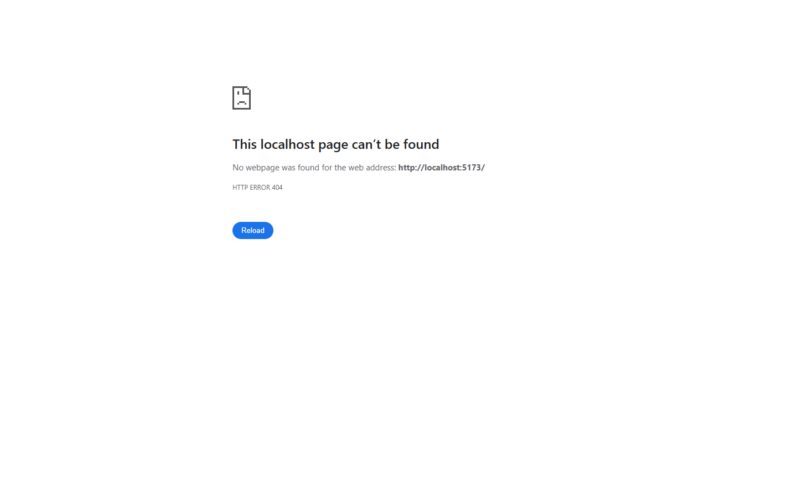
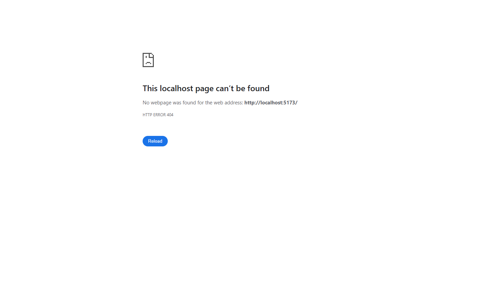
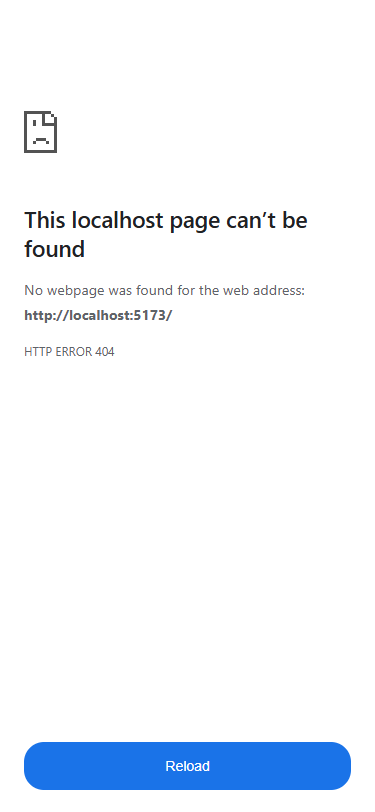

# DevTrack AI

A modern SaaS landing page built using React, Tailwind CSS, and Framer Motion. 
It showcases a job tracking platform for developers with a focus on UI/UX and conversion design.

## Tech Stack
- React (Vite)
- Tailwind CSS
- Framer Motion
- Lucide Icons

## Features
- Fully responsive landing page 
- Animated UI using Framer Motion
- Interactive pricing and feature cards
- Conversion-focused layout (CTA-driven)

## Screenshots

> **Note:** Once you take the actual screenshots of your application, place them in a `public/screenshots/` folder or `src/assets/images/` and update these paths.

### Desktop - Hero


### Desktop - Features


### Desktop - Pricing


### Mobile View


## Project Structure

```text
src/
  assets/
  components/
    CTA.jsx
    Features.jsx
    Footer.jsx
    Hero.jsx
    HowItWorks.jsx
    Navbar.jsx
    Pricing.jsx
    ProblemSolution.jsx
    Stats.jsx
    Testimonials.jsx
    Trust.jsx
  data/
  hooks/
  utils/
  App.jsx
  index.css
  main.jsx
```

## Live Demo
*(Insert your Vercel or Netlify URL here once deployed)*

## Getting Started

1. **Clone the repository:**
   ```bash
   git clone https://github.com/Sarvatha02/DevTrack-AI.git
   cd DevTrack-AI
   ```

2. **Install dependencies:**
   ```bash
   npm install
   ```

3. **Run the development server:**
   ```bash
   npm run dev
   ```
